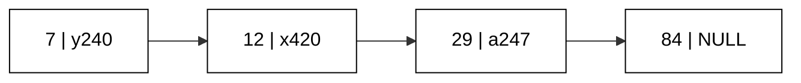

```mermaid
flowchart LR
    A["7 | y240"] --> B["12 | x420"] --> C["29 | a247"] --> D["84 | NULL"]
    classDef node fill:white,stroke:black,color:black;
    classDef label fill:none,stroke:none,color:#ff69b4;
```