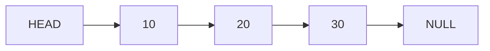
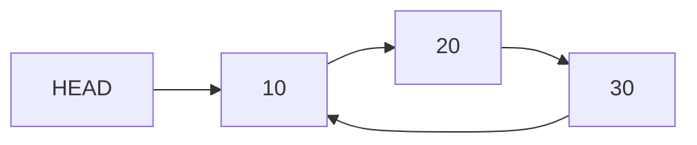

# Singly Linked List




### limitations
- get is O(n) time

# Circular Linked List
A circular linked list is a linked list where the last node points back to the first node.


## Structure

```text
10 → 20 → 30
↑           ↓
└───────────┘
```

The `next` of the last node points to `head` instead of `null`.